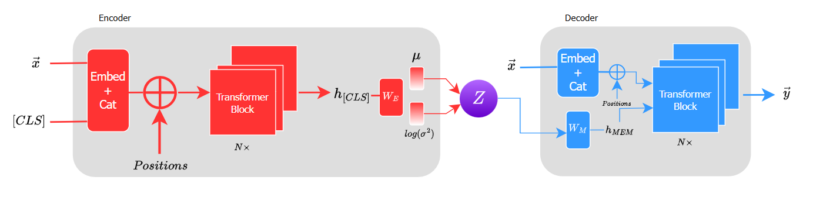
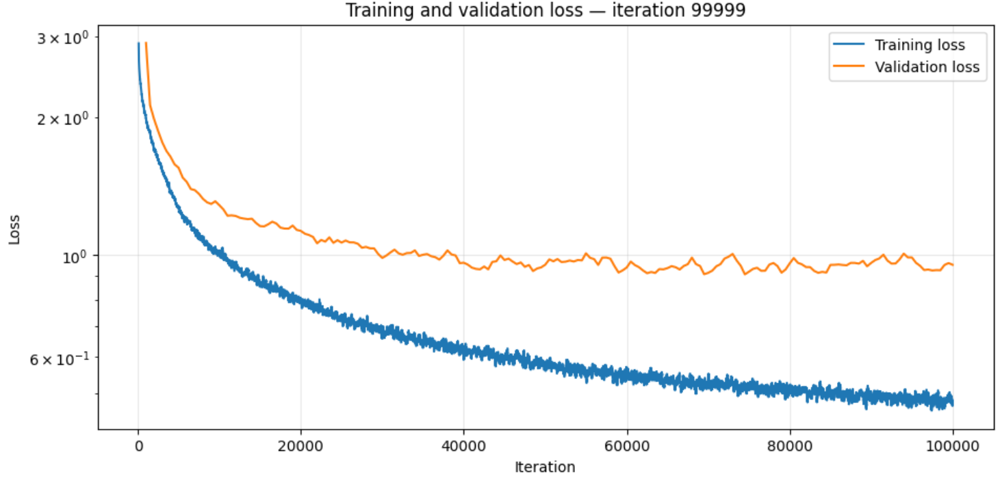
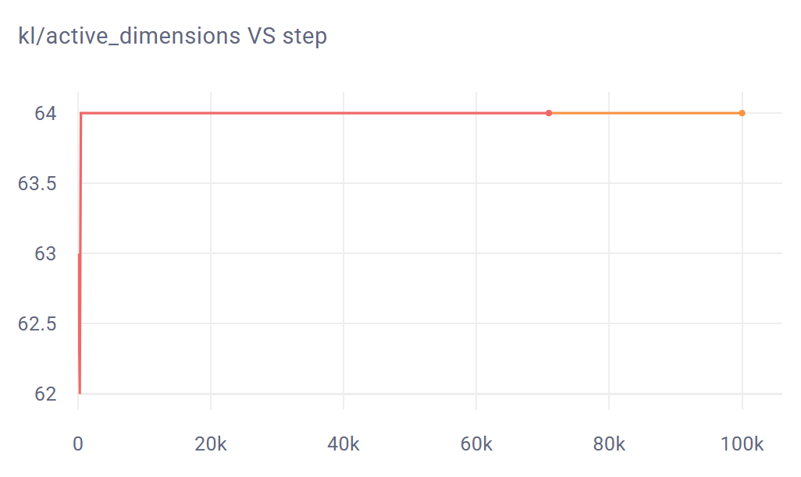

# MahlerVAE

  

## Motivation

This project sprang from MIT 6.S191's Lab 1 Exercise, which was about MIDI music generation. Their model used an LSTM to generate monophonic Irish folk tunes.
Inspired, I wanted to take it a step further by building a more powerful GPT model for polyphonic generation of symphonies in the style of Gustav Mahler.
"There was a similar venture called MahlerNet, but their model used LSTMs"
Hence, I built and trained a GPT model (seq_length=512) in PyTorch using a small dataset consisting of 281 pieces by Late Romantic composers--specifically, pieces composed by Beethoven, 
Brahms, Bruckner, Dvorak, Holst, Mahler, Sibelius, Strauss, Tchaikovsky, and Wagner.
The GPT model was able to generate convincing continuations given a musical idea, but it could not achieve long-term coherence, frequently generated repetitive motifs, and 
most importantly, lacked musical direction. 

## Tokenization scheme
We use a [Compound Word tokenization scheme](https://ojs.aaai.org/index.php/AAAI/article/view/16091) for faster training. This means that each time step is represented by a tuple of categorical fields, instead of a single event token drawn from one vocabulary. In particular, we have the following eleven fields/token attributes:

     Token attributes by idx
     0: family (BOS, EOS, Metric, Note, or PAD)
     1: bar_position
     2: channel
     3: program
     4: pitch
     5: velocity
     6: duration
     7: tempo
     8: time_signature
     9: controller_type
     10: controller_value

## Architecture

The model uses the Optimus architecture presented in [this paper](https://arxiv.org/pdf/2004.04092). This time, however, we use it as a MIDI generation model.
The idea is that, instead of using only a transformer decoder, a transformer encoder first maps a sequence of tokens into parameters of a low-dimensional latent distribution $q(z|x)$. This distribution is usually intended to follow a Gaussian distribution, so the encoder outputs parameters $\mu$ and $\log(\sigma^2)$. Thus, during training, the model learns a continuous latent space intended to capture higher-level musical characteristics. We then take a sample $\mathcal{z}$ from the learned latent variable through a reparameterization trick:

$$z = \mu + \epsilon \odot \exp\left(\frac{1}{2} \log(\sigma^2)\right)$$

where we sample $\epsilon$ ~ $\mathcal{N}(0, \mathcal{I})$. During decoding, $\mathcal{z}$ is projected into a MEM vector $$h_{MEM}$$: a key that can be used by the decoder's self-attention blocks.
Specifically, $$h_{MEM}$$ is an additional key vector (and hence a value vector) that queries can attend to, as shown below.

> The authors of the Optimus architecture proposed two different forms of latent injection: *Memory*, the one we use, and *Embedding*. *Memory* was found to be significantly more effective than *Embedding*, although combining both gave slightly better performance.

   
  <i>Visualization purposes only. This does not reflect values in the actual attention matrices in the model.</i>

The purpose of this memory vector is to provide the autoregressive decoder with persistent access to the latent representation $\mathcal{z}$ across all attention layers, rather than forcing all information to propagate solely through previously generated tokens, as is the case with decoder-only transformers.

## Training
There are two terms in the loss function that we are trying to optimize:

1. **Latent loss ($$L_{KL}$$)**: measures how closely the learned latent variables match a unit Gaussian and is defined by the Kullback-Leibler (KL) divergence. If D denotes latent dimension and B denotes batch size, its loss is given by:

$$\mathcal{L}_{\mathrm{KL}}=\frac{1}{2DB}\sum_{i=1}^{D}\sum_{j=1}^{B}\left(\sigma_{ij}^{2}+\mu_{ij}^{2}-1-\log\sigma_{ij}^{2}\right)$$
      
2. **Reconstruction loss ($$L_{x}$$)**: standard cross-entropy loss between logits and labels. Since we are using a compound word tokenization scheme, we need to compute a loss for each field. If $$W_{F}$$ denotes the field weights (set via *config.yaml*), the loss term is given by:

$$\mathcal{L_{x}}=\frac{\sum_F W_F \cdot \mathrm{CrossEntropy}(\mathrm{logits}_F,\mathrm{labels}_F)}{\sum_F W_F}$$
   
> In the code, we use a mask to dismiss losses associated with "IGNORE" and "PAD" labels as they are not meaningful information that we 
want the model to learn.

The total loss is given by:

$$L_{total} = L_{x} + \beta \cdot L_{KL}$$

where $\beta$ is the weight we assign to the KL loss. 

### Preventing posterior collapse

Perhaps the most common failure mode of Transformer-VAEs is posterior collapse--a phenomenon where the decoder is strong enough that it learns to completely ignore the latent variable produced by the encoder, in which case the model effectively collapses to a decoder-only transformer. It may still perform well, but it loses the benefit given by a VAE architecture, which is the learned latent representation. We have implemented three ways to avoid this:

1. **Make the decoder intentionally weaker**
   

   Perhaps the most obvious solution, we intentionally weaken the decoder so that it learns to use the latent representation $\mathcal{z}$. In <em>config1.yaml</em>, which is the configuration we use to train our sample model,      we use the following hyperparameters for both encoder and decoder:
   

   
              # Model
              latent_dim: 64
              attribute_embedding_dim: 32
              block_size: 1024
              d_model: 256
              num_heads: 8
              dropout: 0.1
              num_layers: 4
   
3. **KL thresholding**
   

   Normally, the $L_{KL}$ objective tries to drive each of its elements $KL_{i}$ towards zero in a step known as regularization. However, that pushes the i'th dimension's posterior to look nearly identical to the prior, carrying very little information about     $x$. With thresholding, we set some threshold <em>dim_target_kl</em> (via <em>config.yaml</em>) below which the objective no longer tries to optimize that dimension's $KL_{i}$. In the code, this is equivalent to manually setting        $KL_{i}$ to zero once its value goes below dim_target_kl. Thus, KL thresholding gives each latent dimension some free capacity to encode information
   

   
5. **KL annealing**
   

   KL annealing lets the model learn to use $z$ before heavily regularizing $z$. Instead of starting training with the full KL weight $\beta$, we define a <em>max_beta</em> that we gradually climb up to during the course of training. <em>ratio_zero</em> defines a threshold such that the current $\beta$ is zero if <em>percent_iteration</em> = <em>num_iterations</em>/<em>total_iterations</em> is below <em>ratio_zero</em>, after which the current $\beta$ linearly increases to max_beta until <em>percent_iteration</em> reaches <em>ratio_zero</em> + <em>ratio_increase</em>. The hyperparameters <em>max_beta</em>, <em>ratio_zero</em>, and <em>ratio_increase</em> must be defined in <em>config.yaml</em>.
   

### Results from training the sample model

Two sample models--a TransformerVAE and a decoder-only transformer--was trained using the aforementioned 281-track dataset and using the configuration <em>config1.yaml</em> for 100k iterations. A validation set was also constructed by taking one track from each composer (except Strauss), giving us 9 tracks for our validation set. The entire 290-track dataset can be downloaded here:

#### Training sets
- [Late Romantic Dataset](https://drive.google.com/drive/folders/1HFO9hRI_NWQGQOf2BiDTSyS6PQ9D3naj?usp=drive_link)

A planned extension to training the model with the SymphonyNet dataset is also currently being worked on. In the meantime, for personal experiments, you may also download the SymphonyNet dataset from their official site:

- [SymphonyNet](https://symphonynet.github.io/)

#### Plots

   
  <i>TransformerVAE training run over 100k iterations</i>

Losses from each field, reconstruction and KL losses, validation losses, as well as the training run of the decoder-only transformer and other metrics may be viewed on Comet.
[View the full training run on Comet!](https://www.comet.com/jorem-sigawa/mahlervae/view/new/panels)

Nearly all losses of both TransformerVAE and decoder-only transformer models converged to roughly the same value. 
> Note that due to Colab's session limits, the TransformerVAE's run was fragmented from 0 to 70k and 70k to 100k.

   
  <i>Active latent dimensions</i>

As shown in the figure above, all 64 latent dimensions are active (that is, $KL_{i}$ > 0.01), demonstrating that we have prevented posterior collapse and that the latent representation $z$ is being used by the decoder meaningfully. 

#### Checkpoints
The sample model checkpoints can be downloaded here. There are two checkpoints. *my_ckpt.pt* contains weights at the 100k'th iteration, while *best_ckpt.pt* contains weights at the iteration where the validation loss was smallest for the entire 100k training run.

[Download TransformerVAE model checkpoints here](https://drive.google.com/drive/folders/1Q_jipHsfXz33HYqb0uqnn-U-QxKU4law?usp=drive_link)

[Download decoder-only transformer model checkpoints here](https://drive.google.com/drive/folders/14pYicsTmfp9jJ0XKpKtyhHKOmbTBg2Hw?usp=drive_link)

## Generation

A crude form of generation involves simply passing an input prompt to the model and sampling from the "softmaxed" logits of the decoder autoregressively. However, without other guardrails in place, the model tends to produce long, repetitive, unbroken chains of controller or note events and with very sparse emissions of metric and positional tokens (see the <em>generation_constraints.py</em> files for more information). This does not mean that the model has failed to learn, but we do need a robust generation scheme to harness its full potential. Admittedly, such a task was simply beyond my depth, and I turned to Codex for assisted stable generation. It produced two files: <em>generation_constraints1.py</em> and <em>generation_constraints2.py</em>. <em>generation_constraints2.py</em> appears to excel for non-interpolative generation, successfully avoiding repetitive motifs, whereas we found <em>generation_constraints1.py</em> better for interpolative generation, but you may experiment with using <em>generation_constraints2.py</em> also.

### Interpolation

This is the core idea motivating the architecture: can we move from one musical idea (say, a quiet chorale) to another (say, a symphonic climax) by moving through the latent space? We encode two prompts: the start prompt and the end prompt, forming the endpoints of our path in latent space. We then use linear interpolation to move through latent space:

    def interpolated_latent(bars_generated):
      alpha = ((bars_generated.float() - interpolation_start_bar) / interpolation_length_bars).clamp(0.0, 1.0).unsqueeze(1)
      return z1 + alpha * (z2 - z1) 
      
### Generation guidelines
- You must first tokenize your input prompt/s using *tokenize.ipynb*.
- *bar_start* refers to the bar at which the model starts generation. Note that your prompt *must* have more number of bars than *bar_start*.
- It is recommended you use a multiple of 4 + 1 (4n + 1) for your *bar_start*.
- For interpolative generation, you may extract samples from your input prompt between *bar_start* and *bar_end* using *sample_bars.ipynb*
- It is recommended to keep *interpolation_start_bar* low (e.g., 1 or 5). Otherwise, the model may start interpolating when degeneration has started to occur.
- The model must produce *interpolation_length_bars* before reaching the end of your *generation_length* for complete interpolation. As a rule of thumb, there are about 50 tokens per bar, thus if your *interpolation_length_bars* = 24, you must have at least a *generation_length* = 50*200 = 1200, though we recommend thrice (3600) this to be sure.
- Using *my_ckpt.py* over *best_ckpt.pt* almost always produced better results.
- You may choose which generation_constraints.py file to use by going over to generations.py and changing

    > from .generation_constraints1 import CompoundREMIGenerationConstraints, generate_constrained_tokens
    
    to
    
    > from .generation_constraints2 import CompoundREMIGenerationConstraints, generate_constrained_tokens

### Generated samples
Here's some sample generations from both the TransformerVAE model and decoder-only transformer model for comparison. We use input prompts, all belonging in the validation set, from Dvorak, Beethoven, and Brahms. At the end, we use the TransformerVAE model for interpolative generation on a Mahler prompt.
> [!WARNING]
> Some sections may become spontaneously loud. Keep volume at a minimal level.

> These midi samples were rendered with the Musyng Kite soundfount.

### Beethoven

<table>
<tr>
  <th width="33%">Sample 1</th>
  <th width="33%">Sample 2</th>
  <th width="33%">Sample 3</th>
</tr>
<tr>
  <td align="center" valign="top">
    <b>Decoder-only Transformer</b>  
    <video src="https://github.com/user-attachments/assets/ae03d6c4-0812-4002-bdfc-3c2311475e40" width="100%" controls></video>
     
    <b>TransformerVAE</b>  
    <video src="https://github.com/user-attachments/assets/1f060db6-02f0-478b-a8e2-f0544a0d4517" width="100%" controls></video>
  </td>

  <td align="center" valign="top">
    <b>Decoder-only Transformer</b>  
    <video src="https://github.com/user-attachments/assets/ffb3f4cf-abef-45df-9cdf-805cfff2ef1d" width="100%" controls></video>
     
    <b>TransformerVAE</b>  
    <video src="https://github.com/user-attachments/assets/c89ffd96-fb88-4601-ac90-b9ebb7867d45" width="100%" controls></video>
  </td>

  <td align="center" valign="top">
    <b>Decoder-only Transformer</b>  
    <video src="https://github.com/user-attachments/assets/546cb20e-0025-41f4-87fc-0e54e1ef6b2b" width="100%" controls></video>
     
    <b>TransformerVAE</b>  
    <video src="https://github.com/user-attachments/assets/944123da-84ea-490e-827a-db8cfa016a54" width="100%" controls></video>
  </td>
</tr>
</table>

### Brahms

<table>
<tr>
  <th width="33%">Sample 1</th>
  <th width="33%">Sample 2</th>
  <th width="33%">Sample 3</th>
</tr>
<tr>
  <td align="center" valign="top">
    <b>Decoder-only Transformer</b>  
    <video src="https://github.com/user-attachments/assets/0f86d406-1626-4ab6-a243-80f0bd3d1c27" width="100%" controls></video>
     
    <b>TransformerVAE</b>  
    <video src="https://github.com/user-attachments/assets/2bbc08a6-7c73-4642-be76-4f690728bee8" width="100%" controls></video>
  </td>

  <td align="center" valign="top">
    <b>Decoder-only Transformer</b>  
    <video src="https://github.com/user-attachments/assets/7ed179cc-5b55-47a3-ab66-8e7b1ba67360" width="100%" controls></video>
     
    <b>TransformerVAE</b>  
    <video src="https://github.com/user-attachments/assets/7486461b-b171-4062-8b77-4aa0aa986c84" width="100%" controls></video>
  </td>

  <td align="center" valign="top">
    <b>Decoder-only Transformer</b>  
    <video src="https://github.com/user-attachments/assets/1b07d563-75e7-4c14-9508-409c1a9da40e" width="100%" controls></video>
     
    <b>TransformerVAE</b>  
    <video src="https://github.com/user-attachments/assets/0ba01a84-2dfd-4928-98a2-335615c2c723" width="100%" controls></video>
  </td>
</tr>
</table>

### Dvořák

<table>
<tr>
  <th width="33%">Sample 1</th>
  <th width="33%">Sample 2</th>
  <th width="33%">Sample 3</th>
</tr>
<tr>
  <td align="center" valign="top">
    <b>Decoder-only Transformer</b>  
    <video src="https://github.com/user-attachments/assets/aa7fd187-1505-480f-80b2-10270a659a9b" width="100%" controls></video>
     
    <b>TransformerVAE</b>  
    <video src="https://github.com/user-attachments/assets/26359c8c-3672-45ca-8c64-f0ae57a28427" width="100%" controls></video>
  </td>

  <td align="center" valign="top">
    <b>Decoder-only Transformer</b>  
    <video src="https://github.com/user-attachments/assets/0ce3f690-4817-4811-8a7c-43752ca4cf68" width="100%" controls></video>
     
    <b>TransformerVAE</b>  
    <video src="https://github.com/user-attachments/assets/9bf31daf-eb0b-4046-97e8-fa0abe87f0cf" width="100%" controls></video>
  </td>

  <td align="center" valign="top">
    <b>Decoder-only Transformer</b>  
    <video src="https://github.com/user-attachments/assets/2707a08e-ecf0-4e4e-b1c6-a0f45e21e9e0" width="100%" controls></video>
     
    <b>TransformerVAE</b>  
    <video src="https://github.com/user-attachments/assets/5a0cbb0f-951b-40bd-b279-d796093fcc05" width="100%" controls></video>
  </td>
</tr>
</table>

### Mahler

This interpolative generation uses bars 29 to 44 and bars 125 to 152 of *Chorus Mysticus* from Mahler's 8th Symphony as the start and end prompts, respectively. Generation begins at 1:16. Through latent-space interpolation, the model develops a clear long-range musical trajectory: an initially restrained, chorale-like string texture gradually becomes denser and more tense, with increasingly prominent tremolo strings driving the piece towards a climax. 

https://github.com/user-attachments/assets/dc279bb4-4c18-4010-867f-25ee925f5538

## Limitations
Autoregressive degeneration remains a massive problem, with some samples losing coherence after only 30 seconds of generation. Furthermore, this incoherence problem appears to be highly dependent on where in a prompt the model starts generating, with stable and relaxed sections producing articulate generations, and dissonant, rising sections producing noticeably disjointed and confused music. However, this should be taken into account with the fact that we have used a very limited, 281-track dataset. It is very probable that significant improvements in coherence can be made by first pretraining on a much larger corpus such as the SymphonyNet dataset and then fine-tuning.

## How to Use

